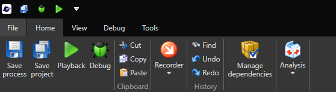
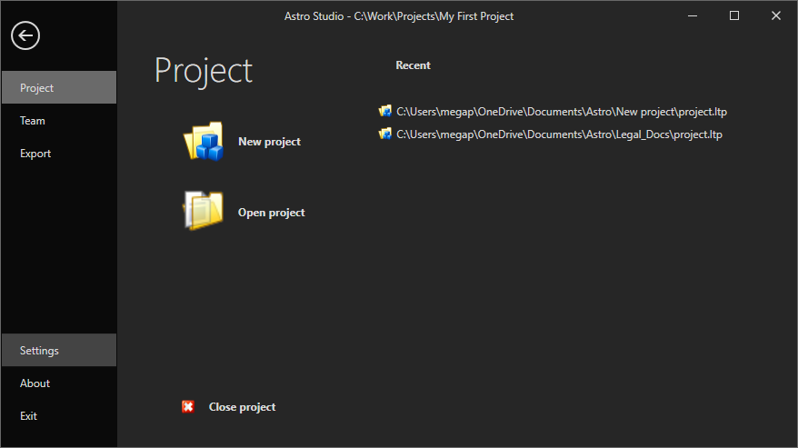
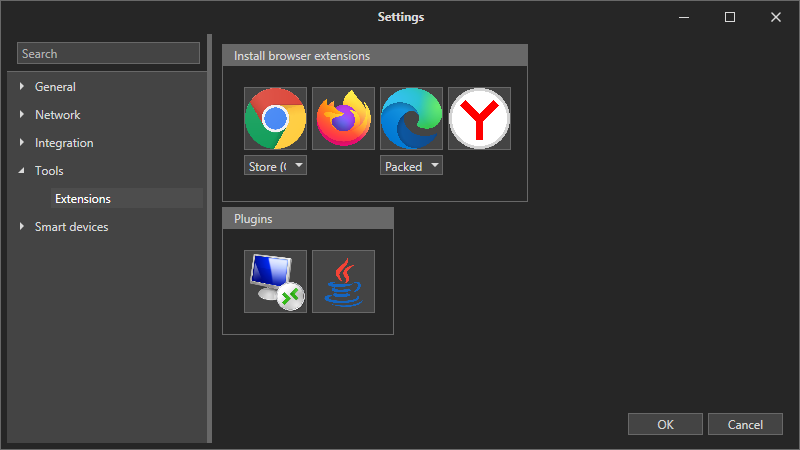
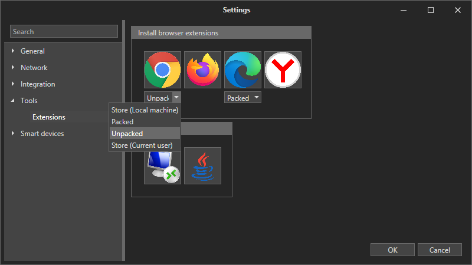
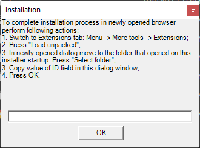
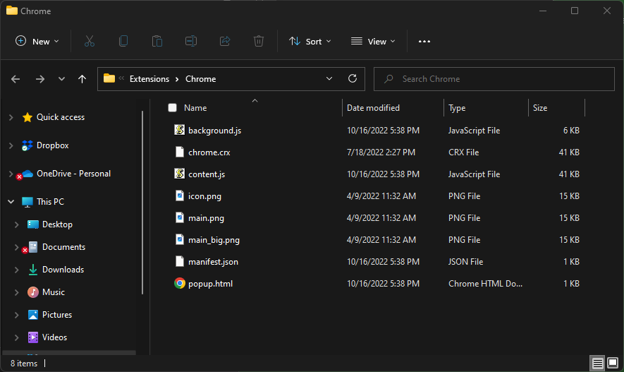
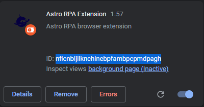
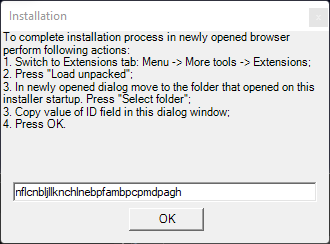
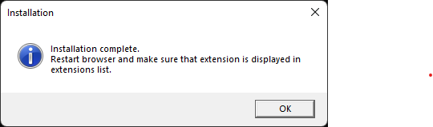

# Chrome

To enable work with the Chrome browser, you need to install the Astro RPA extension. Here's how to do it. 

Select the File tab in the main menu:

In the File window, select Settings:

Then in the left menu - Tools -> Extensions.

In the drop-down menu for Chrome extension, select Unpacked and then click on the Chrome icon.

It will open two windows. The first window contains the instructions for the next steps and the field for entering the extension ID code.

The second is the Windows Explorer window with the Chrome extension folder opened in it. 

Now go to your Chrome settings -> More Tools -> Extensions
In the opened window, click on "Load unpacked."

If there are no buttons, enable Developer mode.&#x20;
Then select the directory where the extension file was saved - check the path in the opened Windows Explorer window:

The Astro RPA extension will appear on the list. 

Copy the ID field and paste it in the first window and click OK

Congratulations! Your extension is successfully installed.

You can verify that the extension is installed in Chrome settings -> More tools -> Extensions.

To install the packed extension:

1. Remove the tick from the checkbox Unpacked. Click on the Chrome icon in Astro in the File -> Settings -> Tools -> Extensions menu&#x20;
2. A window for saving the extension file will open. Choose the folder where to save the file
3. Next go to your Chrome settings -> More Tools -> Extensions&#x20;
4. Drag & drop the file chrome.crx in the Chrome window.
