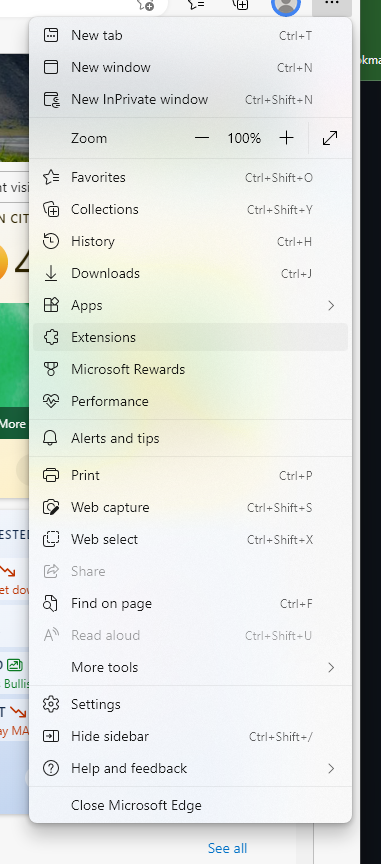
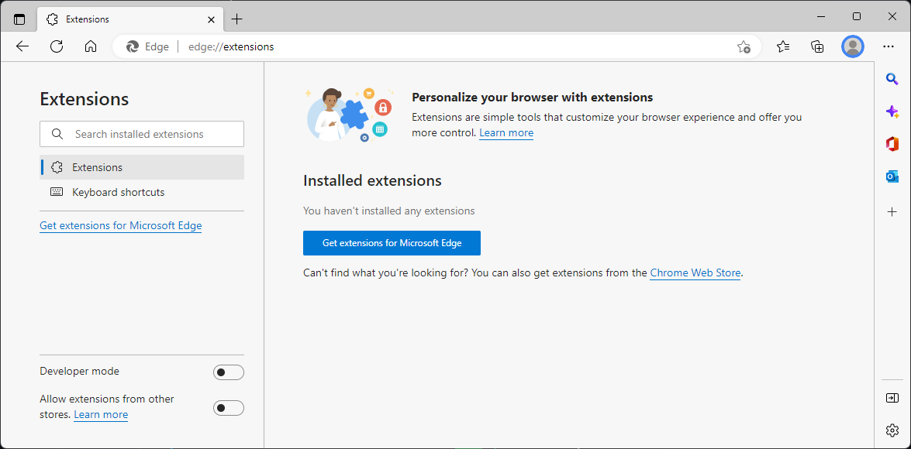
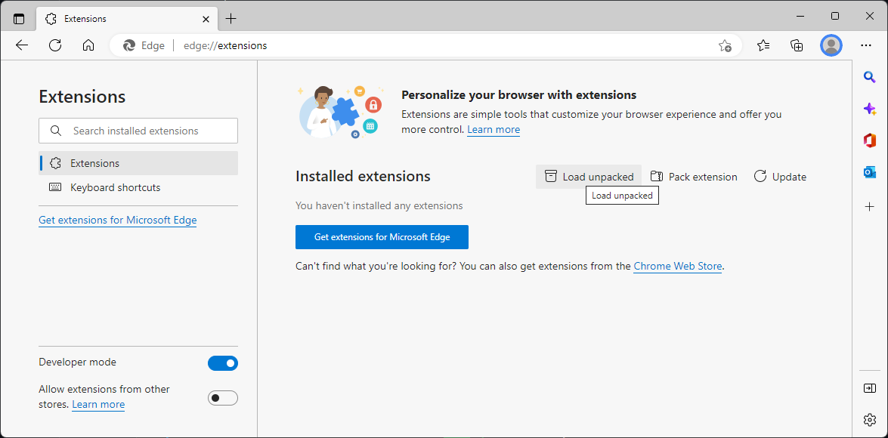
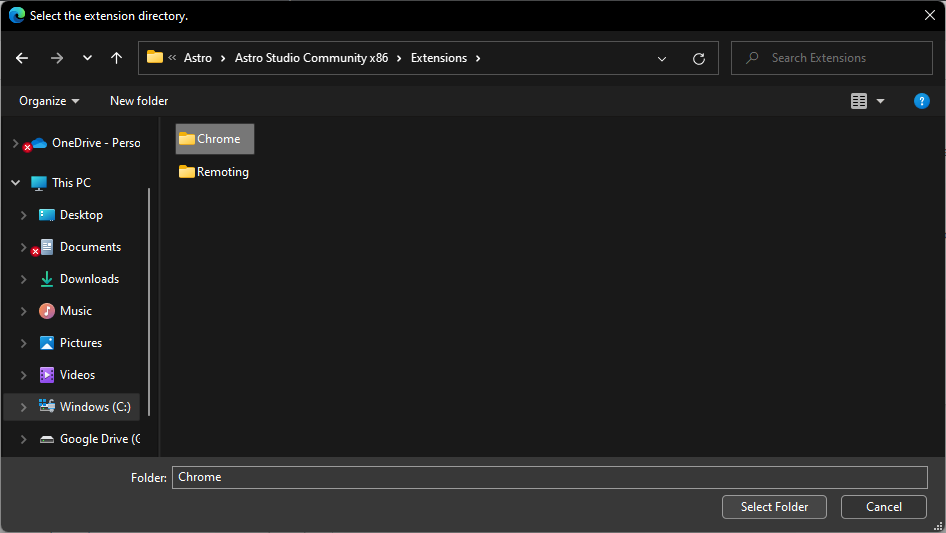
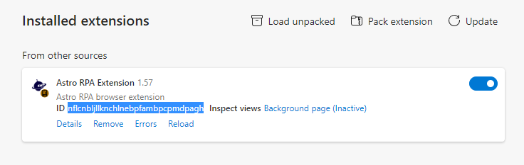
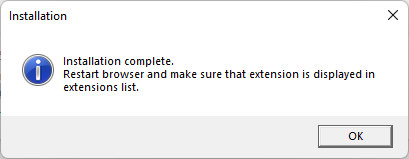
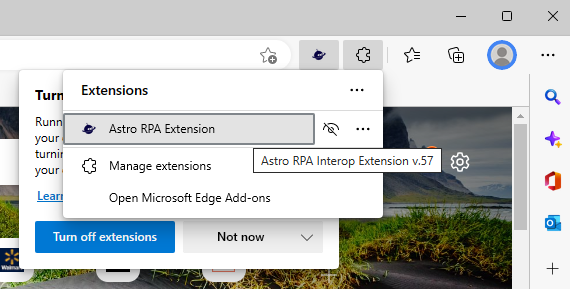

# Microsoft Edge

To enable work with Microsoft Edge browser, you need to install the Astro RPA extension. Here's how to do it.

To install unpacked extension, in Astro Studio select the File tab in the main menu:

In the File window, select Settings:

Then in the left menu - Tools -> Extensions:

In the drop-down menu for Edge extension, select Unpacked and then click on the Edge icon.

It will open two windows. The window #1 contains the instructions for the next steps and the field for entering the extension ID code.

The window #2 is Windows Explorer with the Chrome folder opened in it. This is where the Edge extension is located. 

Now let's install the extension into the Edge browser. Go to Edge Settings -> Menu -> Extensions&#x20;

In the Extensions window activate "Developer mode" 

Now the "Load unpacked" button is available, click on it.

You need to specify the folder with the extension, which is Chrome folder from the window #2. 

Click on "Select Folder" and the Astro RPA Extension will be installed. Now copy the ID code

And paste it into the window #1. Click OK

Your extension is successfully installed.

Restart the browser and check that the extension is installed. Go to Edge Settings -> Menu -> Extensions:

Congratulations! 

To install packed extension:

1. Remove tick from Unpacked checkbox. Click the Edge icon in Astro in the Settings -> Tools -> Extensions menu
2. Go to Microsoft Edge Settings -> Menu -> Extensions&#x20;
3. Drag n drop chrome.crx file into Edge window
